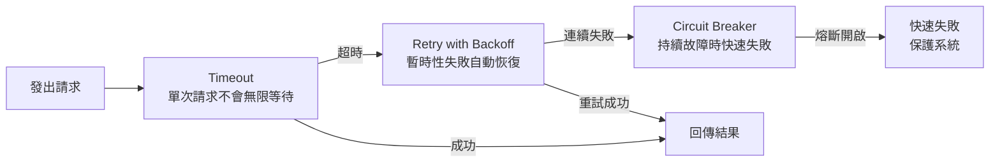

最近在研究 API 請求遲遲沒有回應時該怎麼處理。畫面一直 Loading，使用者不知道還要等多久；在 Production 環境裡，等待中的請求也可能持續佔用資源，影響其他功能。

我整理了 Timeout、Retry with Backoff 和 Circuit Breaker 的做法，分別處理等待太久、暫時失敗和服務持續故障的情況。

## 問題在哪？

想像一個情境：你的前端呼叫了一個第三方 API（比如金流、物流、或是某個資料服務），結果對方的伺服器卡住了，既不回傳成功，也不回傳失敗，就這樣 Hanging 在那邊。

如果你沒有任何防護措施，會發生什麼事？

1. **使用者一直等**：畫面一直轉圈，使用者不知道發生什麼事
2. **資源被佔用**：等待中的請求可能佔用連線、記憶體或其他資源，具體影響取決於架構；非同步等待不一定會卡住一條執行緒
3. **連鎖反應**：一個服務卡住，可能拖垮整個系統

所以，我們需要一套「韌性」（Resilience）機制來應對這種情況。

## 第一道防線：Timeout（超時設定）

先限制單次請求的等待時間，避免它一直卡著。

Timeout 的概念很簡單：設定一個時間限制，如果在這個時間內沒有收到回應，就主動放棄這次請求。

```javascript
// 使用 fetch 搭配 AbortController 實現 Timeout
async function fetchWithTimeout(url, options = {}, timeoutMs = 5000) {
  const controller = new AbortController();
  const timeoutId = setTimeout(() => controller.abort(), timeoutMs);

  try {
    const response = await fetch(url, {
      ...options,
      signal: controller.signal,
    });
    return response;
  } catch (error) {
    if (error.name === "AbortError") {
      throw new Error(`Request timeout after ${timeoutMs}ms`);
    }
    throw error;
  } finally {
    clearTimeout(timeoutId);
  }
}
```

這個範例只限制等待回應標頭的時間：取得 Response 後就清掉計時器，後續讀取回應內容仍可能等很久。它也會覆蓋呼叫端傳入的取消訊號；正式整合時，需要合併取消來源，並依需求把內容讀取算進時間上限。

### Timeout 該設多久？

這沒有標準答案，取決於呼叫的 API 性質：

- **一般 CRUD 操作**：3-5 秒
- **複雜查詢或報表**：10-30 秒
- **檔案上傳**：視檔案大小而定，可能需要更長

這些時間只是起始參考，還要看服務的正常延遲、使用者願意等多久，以及整個操作的時間上限。也要分清楚「前端停止等待」和「伺服器取消處理」：前者不代表後者一定發生。

## 第二道防線：Retry with Backoff（重試機制）

請求失敗有時只是網路抖動，或對方伺服器剛好在重啟，稍後再試就可能成功。

但重試不能亂試，要有策略：

### Exponential Backoff（指數退避）

每次重試之間的等待時間要越來越長。為什麼？因為如果對方伺服器真的有問題，你瘋狂重試只會讓它更慘（雪上加霜）。

```javascript
async function fetchWithRetry(url, options = {}, maxRetries = 3) {
  let lastError;

  for (let attempt = 0; attempt < maxRetries; attempt++) {
    try {
      const response = await fetchWithTimeout(url, options, 5000);

      // 5xx 錯誤也要重試
      if (response.status >= 500) {
        throw new Error(`Server error: ${response.status}`);
      }

      return response;
    } catch (error) {
      lastError = error;
      console.warn(`Attempt ${attempt + 1} failed:`, error.message);

      // 最後一次就不用等了
      if (attempt < maxRetries - 1) {
        // Exponential Backoff: 1秒, 2秒, 4秒...
        const delay = Math.pow(2, attempt) * 1000;
        // 加一點隨機性，避免多個請求同時重試（Thundering Herd）
        const jitter = Math.random() * 1000;
        await sleep(delay + jitter);
      }
    }
  }

  throw new Error(`Failed after ${maxRetries} retries: ${lastError.message}`);
}

function sleep(ms) {
  return new Promise((resolve) => setTimeout(resolve, ms));
}
```

### 什麼情況該重試？

- 網路錯誤（Network Error）、5xx 錯誤（Server Error）和 Timeout 可以考慮重試。
- 多數 4xx 錯誤（Client Error）需要先處理請求本身的問題，直接重試通常沒有用。429 限流則可能需要依伺服器告知的時間稍後再試。
- 401 認證失效通常是 Token 過期，可以先刷新 Token 再重試一次。
- 403 代表伺服器拒絕存取，可能和權限或其他存取限制有關。單純重送請求通常沒用，需要先釐清拒絕原因。

上面的程式碼把 5xx 都列入重試，是簡化示範。正式使用時要區分錯誤類型，確認操作能否安全重送，也要把等待間隔算進整體時間上限。

## 第三道防線：Circuit Breaker（斷路器）

Circuit Breaker 的靈感來自電路的保險絲。電流異常時，保險絲會斷開；服務持續失敗時，斷路器則暫停呼叫，保護系統資源。

### 為什麼需要 Circuit Breaker？

以前面的範例來說，最多嘗試 3 次，也就是初次請求加上 2 次重試。若每次都等滿 5 秒，再加上退避和隨機等待，總共可能接近 18–20 秒。當許多請求同時在等，系統的連線和其他資源也可能逐漸吃緊。

Circuit Breaker 的邏輯是：**如果某個服務連續失敗太多次，就暫時不要再呼叫它，直接回傳錯誤**。過一段時間後再「試探性」地呼叫看看，如果成功了就恢復正常。

### 三種狀態

1. **Closed（關閉）**：正常運作，所有請求都會送出
2. **Open（開啟）**：斷路器跳開，所有請求直接失敗，不會真的送出
3. **Half-Open（半開）**：試探階段，允許少量請求通過測試服務是否恢復

```javascript
class CircuitBreaker {
  constructor(options = {}) {
    this.failureThreshold = options.failureThreshold || 5; // 連續失敗幾次就跳開
    this.resetTimeout = options.resetTimeout || 30000; // 多久後嘗試恢復（毫秒）

    this.state = "CLOSED";
    this.failureCount = 0;
    this.lastFailureTime = null;
    this.halfOpenInFlight = false; // Half-Open 狀態下是否已有試探請求在進行
  }

  async call(fn) {
    // 如果斷路器開啟，檢查是否該進入半開狀態
    if (this.state === "OPEN") {
      if (Date.now() - this.lastFailureTime >= this.resetTimeout) {
        this.state = "HALF_OPEN";
      } else {
        throw new Error("Circuit breaker is OPEN - request blocked");
      }
    }

    // Half-Open 時只放行一個試探請求，避免服務剛恢復就被一次湧入的請求打垮
    if (this.state === "HALF_OPEN") {
      if (this.halfOpenInFlight) {
        throw new Error("Circuit breaker is HALF_OPEN - probing in progress");
      }
      this.halfOpenInFlight = true;
    }

    try {
      const result = await fn();

      // 請求成功，重置狀態
      this.onSuccess();
      return result;
    } catch (error) {
      // 請求失敗，更新失敗計數
      this.onFailure();
      throw error;
    } finally {
      this.halfOpenInFlight = false;
    }
  }

  onSuccess() {
    this.failureCount = 0;
    this.state = "CLOSED";
  }

  onFailure() {
    this.failureCount++;
    this.lastFailureTime = Date.now();

    if (this.failureCount >= this.failureThreshold) {
      this.state = "OPEN";
      console.warn("Circuit breaker opened!");
    }
  }
}

// 使用範例
const paymentBreaker = new CircuitBreaker({
  failureThreshold: 5,
  resetTimeout: 30000,
});

async function processPayment(data) {
  return paymentBreaker.call(() =>
    fetchWithRetry("https://api.payment.com/charge", {
      method: "POST",
      headers: {
        "Content-Type": "application/json",
        // 用 orderId 當 Idempotency Key：同一筆訂單就算被重試多次，
        // 伺服器端也能辨識出是同一筆請求，回傳原本的結果而不會重複扣款
        "Idempotency-Key": data.orderId,
      },
      body: JSON.stringify(data),
    }),
  );
}
```

上面的斷路器是概念示範，還有併發限制：較早送出的請求若在跳開後才成功，仍會把狀態重設為 Closed。正式使用時，需要辨識請求屬於哪一輪狀態，避免舊請求改動目前的斷路器，也不能讓其他請求清掉半開試探的標記。

像扣款這種非冪等（non-idempotent）操作，重試前務必確認 API 支援 Idempotency Key，否則 Timeout 後重試可能造成重複扣款。上面範例帶上 `Idempotency-Key`，讓伺服器端能辨識重複請求。

## 實務上的整合

在真實世界的應用中，這三個機制通常會一起使用，形成層層防護：


```mermaid
flowchart LR
    A["發出請求"] --> B["Timeout<br/>單次請求不會無限等待"]
    B -->|"超時"| C["Retry with Backoff<br/>暫時性失敗自動恢復"]
    C -->|"連續失敗"| D["Circuit Breaker<br/>持續故障時快速失敗"]
    B -->|"成功"| E["回傳結果"]
    C -->|"重試成功"| E
    D -->|"熔斷開啟"| F["快速失敗<br/>保護系統"]
```

如果你用的是 Node.js，可以考慮使用現成的套件：

- **[cockatiel](https://www.npmjs.com/package/cockatiel)**：功能完整的 resilience 套件
- **[axios-retry](https://www.npmjs.com/package/axios-retry)**：如果你用 Axios，這個插件很方便
- **[opossum](https://www.npmjs.com/package/opossum)**：專門的 Circuit Breaker 實作

## 結語

外部服務總有失敗的時候，我會把這件事當成設計時就要處理的情境。Timeout 限制等待時間，Backoff 讓重試有間隔，Circuit Breaker 則在持續故障時停止送出請求。

實作起來需要多花一些工，但第三方 API 掛掉時，至少能讓自己的服務快速回報錯誤或降級，保留資源給其他功能。

---

站內相關文章：

- [前端測試實戰 — Vitest 入門](/posts/frontend-testing-vitest-guide/)
- [Nuxt 3 JWT 身份驗證實作筆記](/posts/nuxt3-jwt-pinia-auth/)
