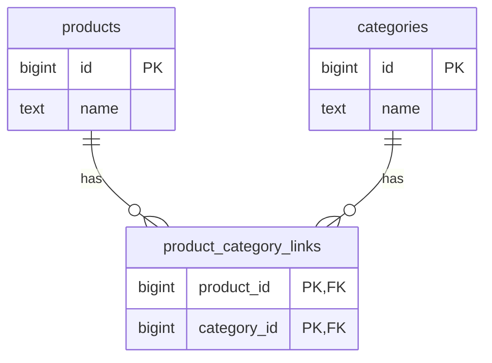

最近在想一些資料庫設計的問題。像是票只剩一張，兩個人同時按下購買，要怎麼避免兩邊都買到？

我一開始想到比送出時間，誰先送，票就給誰。但如果兩邊都已經讀到「還有一張」，然後各自建立訂單，還是可能賣出兩張。

另外也查了商品分類和共用付款功能的做法，整理成這份筆記。範例用 PostgreSQL，SQL 就是操作資料庫的指令。

## 先想清楚規則，再決定怎麼存

訂票時，是下單就扣庫存，還是付款才扣？沒付款的票要保留多久？

商品分類也是，一個商品能放進幾個分類？同一組配對能不能重複？平常比較常查「商品有哪些分類」，還是「分類有哪些商品」？

想好這些，再決定欄位和資料表。資料庫也能幫忙檢查：`NOT NULL` 要求欄位有值，外鍵檢查對應資料是否存在，唯一限制擋重複，`CHECK` 則能擋住庫存小於 0 這種值。[PostgreSQL 的限制條件文件](https://www.postgresql.org/docs/current/ddl-constraints.html)有例子。

<details>
<summary>補充：價格改了，舊訂單怎麼辦？時間又怎麼存？</summary>

舊訂單要保留當時的成交價和必要資料，也能用商品 ID 找回商品。這和到處複製分類名稱不同：分類改名要同步，舊訂單價格則得留下。

金額可以用固定單位的整數或 `numeric`（精確的十進位數值），幣別、單位和四捨五入方式也要訂好，詳見 [PostgreSQL 的數值型別說明](https://www.postgresql.org/docs/current/datatype-numeric.html)。

付款時間、建立時間可以用 `timestamptz` 記錄時間點，按資料庫連線的時區顯示；原本的時區名稱要另外存。詳見 [PostgreSQL 的時間型別說明](https://www.postgresql.org/docs/current/datatype-datetime.html)。時間記得再準，兩個人同時搶票的問題還是要另外處理。

</details>

## 最後一張票，怎麼避免賣兩次？

兩個請求都讀到庫存 1，再各自算出「買完剩 0」，就可能成立兩張訂單，庫存卻仍是 0。光檢查庫存不能小於 0，抓不到這種錯誤。

這就是 race condition：幾件事同時進行，執行的先後順序讓結果出了問題。

先看「每次買一張」的情況。我們可以用一個帶條件的 `UPDATE`，讓資料庫在扣票時一併確認還有庫存：

```sql
CREATE TABLE ticket_inventory (
    event_id bigint PRIMARY KEY,
    remaining integer NOT NULL CHECK (remaining >= 0)
);

-- 練習資料：活動 42 只剩一張票。
INSERT INTO ticket_inventory (event_id, remaining)
VALUES (42, 1);

UPDATE ticket_inventory
SET remaining = remaining - 1
WHERE event_id = 42
  AND remaining > 0
RETURNING event_id, remaining;
```

在 PostgreSQL 預設的 Read Committed 設定下，兩個請求改同一筆庫存，後來的會等前一筆操作結束。如果前一筆已確認存好，資料庫會拿新的庫存再檢查一次 `WHERE` 條件。第一個扣到 0，第二個就扣不到了，詳見 [PostgreSQL 同時更新資料時的處理方式](https://www.postgresql.org/docs/current/transaction-iso.html#XACT-READ-COMMITTED)。

確定扣到票才建立訂單；沒扣到，要分清楚是售完還是活動不存在。

扣票和建立待付款訂單，還得放在同一條資料庫連線、同一個 transaction（交易）裡，讓它們一起成功或一起取消。兩步都完成才 `COMMIT` 確認存下來，失敗就 `ROLLBACK` 撤回這次變更；存好後才回應購買成功。可看 [PostgreSQL 的交易入門](https://www.postgresql.org/docs/current/tutorial-transactions.html)。

不過，單純把「`SELECT` 讀庫存，再 `UPDATE` 扣票」包在 `BEGIN`、`COMMIT` 裡，預設設定下仍可能讓兩邊讀到同一份舊庫存。需要先讀再判斷時，可以用 `SELECT ... FOR UPDATE`，先鎖住那筆資料，讓衝突的更新等待。詳見[讀取時鎖住資料的用法](https://www.postgresql.org/docs/current/explicit-locking.html#LOCKING-ROWS)。

<details>
<summary>想動手試：開兩個 SQL 視窗搶同一張票</summary>

在測試資料庫開兩個使用不同連線的 SQL 視窗，結束其他未完成交易，把活動 42 的庫存重設為 1。資料表只建一次。

A 先執行，暫時不確認存下來：

```sql
BEGIN;

UPDATE ticket_inventory
SET remaining = remaining - 1
WHERE event_id = 42 AND remaining > 0
RETURNING remaining;

-- 先不要 COMMIT，讓這筆交易保持未完成。
```

再到 B 執行，它會等 A：

```sql
BEGIN;

UPDATE ticket_inventory
SET remaining = remaining - 1
WHERE event_id = 42 AND remaining > 0
RETURNING remaining;

-- 這裡會等待連線 A 結束交易。
```

A 執行 `COMMIT`，B 會因為庫存 0 而更新不到資料，再用 `ROLLBACK` 結束 B。重設庫存後再試一次，改讓 A 執行 `ROLLBACK`，B 就有機會扣到票，再執行 `COMMIT`。

這個練習只測扣票。還要加上建立訂單的步驟，故意讓訂單存不進去，確認扣掉的票會一起還原。

先鎖住資料、讓別人等的做法，叫「悲觀鎖」：

```sql
SELECT event_id, remaining
FROM ticket_inventory
WHERE event_id = 42
FOR UPDATE;
```

鎖會留到交易結束，所以別鎖著資料等使用者回覆或外部 API。需要鎖多筆資料時，照相同順序鎖，能減少你等我、我也等你的情況，這叫 deadlock（死鎖）。詳見 [PostgreSQL 的死鎖說明](https://www.postgresql.org/docs/current/explicit-locking.html#LOCKING-DEADLOCKS)。

另一種做法是「樂觀鎖」：先讀資料，寫入時再確認這段期間有沒有被改過。假設有一個每次更新都增加的 `version` 欄位：

```sql
UPDATE ticket_inventory
SET remaining = remaining - 1,
    version = version + 1
WHERE event_id = $1
  AND version = $2
  AND remaining > 0
RETURNING remaining, version;
```

`$1`、`$2` 是程式帶入的活動 ID 和先前讀到的版本。沒更新到資料，要分清楚是版本變了、售完或活動不存在。衝突多時，可能反覆重試，也仍會遇到資料庫鎖定。

Serializable 要求多筆交易同時做完後，結果能和某種「排好順序，一筆一筆做」的方式一致。有些交易會因衝突失敗，得整筆重試，見 [Serializable 的處理方式](https://www.postgresql.org/docs/current/transaction-iso.html#XACT-SERIALIZABLE)。

可重試的死鎖等錯誤，要按類型重跑整筆交易、限制次數；悲觀鎖則要留意等待和交易時間。詳見[交易失敗後的重試說明](https://www.postgresql.org/docs/current/mvcc-serialization-failure-handling.html)。[這串 Stack Overflow 討論](https://stackoverflow.com/questions/11532550/atomic-update-select-in-postgres)用工作佇列示範「內層先挑一筆，外層再更新」時，別的請求如何插進來，還是得看 SQL 怎麼寫。

</details>

付款時也可能撞在一起：一邊通知付款成功，一邊因為逾期把票放回去，訂單就不能各改各的。可以先用短交易存好「待付款」，再呼叫金流，之後更新結果或核對帳務。資料庫的 `ROLLBACK` 不會幫你取消外部扣款。

同一筆付款送兩次，也要認得出來。可以用 idempotency key 當作操作識別碼，在適當範圍內保存、用唯一限制擋重複，也要檢查同一個碼是否送了不同內容。金流端則按對方規格處理，詳見 [Stripe 避免請求重複執行的說明](https://docs.stripe.com/api/idempotent_requests)。webhook 是金流主動送來的通知，也可能重送，見[重複通知的處理方式](https://docs.stripe.com/webhooks#handle-duplicate-events)。

Redis 能暫存資料或排隊，但庫存可能過時，下單仍要確認。用它協調誰能先操作，也得管鎖多久、誰拿到鎖，釋放時確認是自己的鎖。過期後別人可能已接手，寫入資料庫失敗時怎麼辦也要想好。[Redis 官方的分散式鎖說明](https://redis.io/docs/latest/develop/clients/patterns/distributed-locks/)有細節。排隊、限制請求量能減輕負擔，怎麼排才公平則是另一個問題。

## 商品和分類，中間多一張表

一個商品能有多個分類，一個分類也能放很多商品，這就是「多對多」。

如果只在商品表 `products` 放一個 `category_id`，一個商品就只能記一個分類。可以多放一張表，專門記「哪個商品屬於哪個分類」：

- `products` 存商品。
- `categories` 存分類。
- `product_category_links` 存商品和分類的配對。



<details>
<summary>建立這三張表的 SQL</summary>

```sql
CREATE TABLE products (
    id bigint GENERATED ALWAYS AS IDENTITY PRIMARY KEY,
    name text NOT NULL
);

CREATE TABLE categories (
    id bigint GENERATED ALWAYS AS IDENTITY PRIMARY KEY,
    name text NOT NULL
);

CREATE TABLE product_category_links (
    product_id bigint REFERENCES products(id),
    category_id bigint REFERENCES categories(id),
    PRIMARY KEY (product_id, category_id)
);

CREATE INDEX product_category_links_category_product_idx
ON product_category_links (category_id, product_id);
```

</details>

商品 101 同時屬於 3C 分類 3、促銷分類 8，就存 `(101, 3)`、`(101, 8)`；商品 102 也能配到分類 3。新增或移除分類，就增刪那組配對。

商品 ID 和分類 ID 一起當主鍵，叫「複合主鍵」，能擋重複配對，兩個欄位也不能空著。外鍵則確認商品、分類存在。[PostgreSQL 的多對多範例](https://www.postgresql.org/docs/current/ddl-constraints.html#DDL-CONSTRAINTS-FK)用的也是這個做法。

<details>
<summary>補充：查商品的分類、替配對加編號，以及刪除資料</summary>

查商品 101 有哪些分類，就把配對表和分類表接起來查，這叫 join：

```sql
SELECT c.id, c.name
FROM product_category_links AS pc
JOIN categories AS c ON c.id = pc.category_id
WHERE pc.product_id = 101
ORDER BY c.id;
```

商品加入分類的時間、在分類裡的顯示順序，也能存這張配對表，因為同一商品放在不同分類，這些值可能不同。

把程式物件和資料表接起來的工具（ORM），或其他表需要指向這組配對時，可以給它獨立編號，但仍要保留 `UNIQUE (product_id, category_id)` 擋重複。像報名還有繳費、取消紀錄，就可能需要這樣管理，見 [Stack Overflow 對配對表主鍵的討論](https://stackoverflow.com/questions/23476623/table-composed-purely-of-foreign-keys)。

範例沒設定連帶刪除（cascade），配對還在就不能直接刪商品或分類。要不要一起刪、舊訂單留多久，得另訂規則。

資料庫的陣列有運算和索引，和逗號串成的文字不同。這裡要管理分類、擋重複、從兩邊查，用配對表比較好處理。可看[陣列設計提醒](https://www.postgresql.org/docs/current/arrays.html#ARRAYS-SEARCHING)和[能用於陣列查詢的 GIN 索引](https://www.postgresql.org/docs/current/indexes-types.html#INDEXES-TYPES-GIN)。

</details>

## 一次只顯示 25 筆，查詢就會快嗎？

查大量商品時，我先想到分頁和排序。但畫面只顯示 25 筆，資料庫可能仍要翻很多資料，才能找到這 25 筆。

查分類 3 的商品，可以把配對表和商品表接起來：

```sql
SELECT p.id, p.name
FROM product_category_links AS pc
JOIN products AS p ON p.id = pc.product_id
WHERE pc.category_id = 3
ORDER BY p.id
LIMIT 25;
```

索引有點像書的索引，讓資料庫有機會更快找到需要的資料。主鍵已有 `(product_id, category_id)` 索引，另外加 `(category_id, product_id)`，方便先按分類找商品。欄位順序會影響怎麼查，實際有沒有用到，還是要看資料庫怎麼執行，見[多欄位索引的說明](https://www.postgresql.org/docs/current/indexes-multicolumn.html)。

`LIMIT 25` 只限制回傳幾筆。想知道時間花在哪，可以用接近實際的資料量和分布，跑 `EXPLAIN (ANALYZE, BUFFERS)`，看資料庫讀了多少、花了多久。

小表一筆一筆讀（Seq Scan）不一定慢；索引也佔空間，寫入時得更新。`ANALYZE` 會真的執行查詢，這裡用讀取範例，詳見[查詢執行過程的查看方式](https://www.postgresql.org/docs/current/using-explain.html)。

<details>
<summary>補充：查詢慢在哪？下一頁也能換個查法</summary>

預估和實際讀取筆數差很多時，可以查統計資料和資料分布。熱門分類含大部分商品時，查法可能不同。也能看索引條件、讀完又篩掉多少、接表時重複查幾次，以及排序量。

只需要 ID 和名稱，就別帶回大型描述和圖片資料。每個商品各查一次分類，也會多跑很多 SQL。先量測，再考慮一次查一批、改 SQL 或調整存法。

用 `OFFSET` 跳過前面的資料，資料庫仍要處理那些資料，越後面的頁面可能越慢。[PostgreSQL 的分頁說明](https://www.postgresql.org/docs/current/queries-limit.html)也提醒，排序要穩定，才能知道每頁拿到哪些資料。如果用不重複的 ID 排序，下一頁可以從上一頁最後的 ID 往後查：

```sql
SELECT p.id, p.name
FROM product_category_links AS pc
JOIN products AS p ON p.id = pc.product_id
WHERE pc.category_id = $1
  AND p.id > $2
ORDER BY p.id
LIMIT 25;
```

`$1` 是分類，`$2` 是上一頁最後的 ID。這叫游標分頁，但不方便直接跳到任意頁碼。若按建立時間排序而時間會重複，就得加 ID 一起排序、判斷下一頁從哪開始。

翻頁期間，商品也可能被移入或移出分類。如果需要每一頁都看同一個時間點的資料，得另外設計。

</details>

## PostgreSQL 還是 MongoDB？

我比較熟前端，容易先想「像不像 JSON、欄位會不會變」。不過，選資料庫還得看平常怎麼用：哪些資料常一起讀？哪些修改必須一起成功？

商品、分類、訂單和付款常要互相對照，我會先考慮分表記錄、靠 ID 接起來。適合整份資料讀寫時，再評估 MongoDB 的文件存法，也就是把一份資料存成類似 JSON 的結構：放在一起，還是另外存、用 ID 找？複製到不同地方的資料怎麼更新？[MongoDB 的資料設計說明](https://www.mongodb.com/docs/manual/data-modeling/)也從這些使用方式談起。

欄位沒填可以用 `NULL`，PostgreSQL 也支援 [JSON 型別](https://www.postgresql.org/docs/current/datatype-json.html)。哪個比較快，得用實際的存法、查詢和資料量測，光看資料庫名稱或 SQL 寫得好不好，還不夠。

MongoDB 更新單份文件，可以做到整筆成功或整筆失敗；修改多份文件時，則要評估用交易的成本，見 [MongoDB 對一起成功、一起失敗的說明](https://www.mongodb.com/docs/manual/core/write-operations-atomicity/)。欄位要放什麼型別、哪些一定要填，也能透過[資料格式檢查](https://www.mongodb.com/docs/manual/core/schema-validation/)來限制。

## 付款功能改了，怎麼確認其他入口還能用？

再想一個例子：十個入口共用信用卡功能，入口一想新增銀行，其他九個還要照常付款。如果每次都靠刷卡、退款來確認，每改一次就得重跑，還蠻累的。

可以先把各入口原本的付款方式、金額和結果寫成測試，再加新銀行的案例。入口一的設定也要只用在入口一，別直接換掉大家共用的預設值。

測試可以從小到大：

- 單元測試先測一小段邏輯，例如選哪家廠商、金額怎麼算、出錯怎麼處理。
- 整合測試把服務、資料庫和連接金流的程式接起來，確認訂單狀態、失敗後資料是否還原。模擬金流能測自己的程式；真實串接則搭配金流提供的測試環境（sandbox）。
- E2E 測試從付款入口走到結果頁，再查訂單是否正確，用可控制的金流回應和能重複使用的測試資料。

改完後再確認舊功能，就是回歸測試，可以包含上面幾種。十個入口跑同一套流程、帶入各自規則，叫[參數化測試](https://playwright.dev/docs/test-parameterize)；再加上入口一的新銀行，以及不符合規則時應拒絕付款的案例。

付款被拒絕、等不到回應（timeout）、重複送出或通知、寫入資料庫失敗都要測。除了畫面和 HTTP 回應狀態，還要查金額、廠商和資料。已扣款卻沒回應，要查詢或對帳；失敗後回到哪個狀態，則看規格。

TDD 是先寫測試再實作。可以先寫「入口二仍用原本廠商」和「入口一選新增銀行」，確認測試會失敗，再實作到通過，最後整理程式碼，見 [Martin Fowler 的說明](https://martinfowler.com/bliki/TestDrivenDevelopment.html)。沒全程照 TDD 做，也能先補舊功能的測試。操作體驗和真實串接仍需要人工確認，測過哪些、沒測哪些也要記下來。

修改資料表通常叫 migration。先複製一份接近真實使用情況的舊資料來試，確認舊訂單和入口能用。新舊程式同時運作時，先加欄位、補齊核對舊資料，再切換讀寫；等舊程式不用舊欄位了，才移除。補舊資料時，新寫進來的資料也要一起處理，或先暫停寫入。

加 `NOT NULL` 或唯一限制前，要先查舊資料有沒有空值或重複，見[修改資料表的說明](https://www.postgresql.org/docs/current/sql-altertable.html)。程式換回舊版，不會讓資料自動復原；刪欄位或轉換資料前，得備份並練習還原。

接下來想拿小型商品與訂票 API 練習分類查詢、搶最後一張票：成功時只有一張有效訂單、庫存 0；故意讓訂單存不進去時，庫存回到 1。這得用真實資料庫，永遠成功的模擬結果（mock）測不到外鍵、重複資料和交易問題。再改一項付款設定，看看舊入口的測試能不能抓到錯誤。

## 站內相關文章

- [用 Vue 的觀念理解 Laravel：前端工程師的後端入門筆記](/posts/laravel-php-first-backend/)
- [前端測試實戰：以 Vitest 為例](/posts/frontend-testing-vitest-guide/)
- [API 請求卡住怎麼辦？Timeout、Retry 與 Circuit Breaker](/posts/api-resilience-patterns/)
