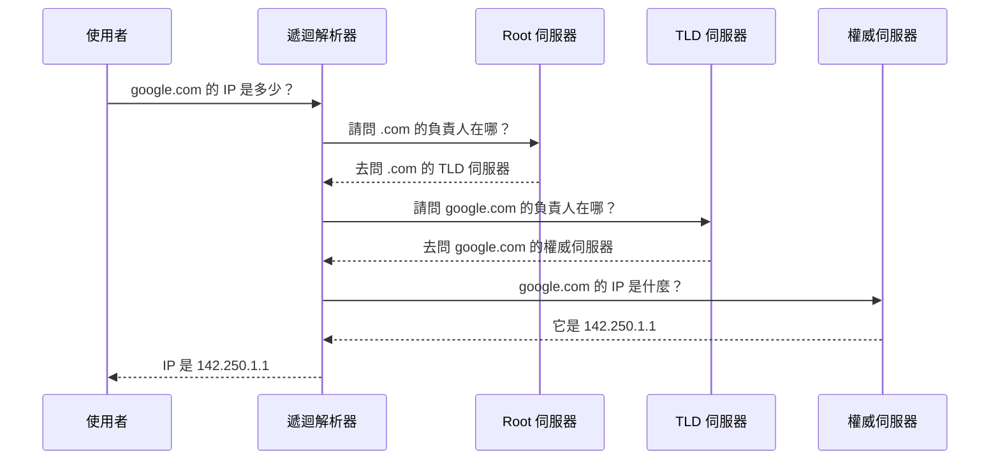

在[網路運作原理](/posts/how-the-internet-works/)裡，我提過 DNS（Domain Name System）會把網址轉換為 IP 位址。這篇接著看查詢怎麼進行，以及網站還在運作、卻因 DNS 問題連不上時，可以從哪裡查起。

## DNS 的階層式架構

DNS 是分散式、階層式的資料庫系統，可以用跨國公司的組織架構來理解各層的分工：

1. **根域名伺服器（Root Nameservers）**：總公司，知道每個頂級域名（.com, .tw, .org）的負責人在哪。
2. **頂級域名伺服器（TLD Nameservers）**：部門經理，管理特定結尾的網域（例如 .com 的註冊局）。
3. **權威名稱伺服器（Authoritative Nameservers）**：專案負責人，真正知道該網域 IP 的伺服器（通常是 Cloudflare, AWS Route53 或你的網域註冊商）。

## 當你輸入 google.com 時發生了什麼事？

這個過程叫做 DNS 解析，包含兩種查詢方式。使用者向遞迴解析器發出遞迴查詢（Recursive Query），請它查到底並回傳答案。解析器再向 Root、TLD、權威伺服器發出迭代查詢（Iterative Query），一路取得下一站的線索，直到找到答案：


```mermaid
sequenceDiagram
    participant User as 使用者
    participant Resolver as 遞迴解析器
    participant Root as Root 伺服器
    participant TLD as TLD 伺服器
    participant Auth as 權威伺服器

    User->>Resolver: google.com 的 IP 是多少？
    Resolver->>Root: 請問 .com 的負責人在哪？
    Root-->>Resolver: 去問 .com 的 TLD 伺服器
    Resolver->>TLD: 請問 google.com 的負責人在哪？
    TLD-->>Resolver: 去問 google.com 的權威伺服器
    Resolver->>Auth: google.com 的 IP 是什麼？
    Auth-->>Resolver: 它是 142.250.1.1
    Resolver-->>User: IP 是 142.250.1.1
```

**遞迴解析器（Recursive Resolver）** 通常由你的 ISP（中華電信）或公共 DNS（Google 8.8.8.8, Cloudflare 1.1.1.1）提供。它負責幫你跑腿問路，並且**快取（Cache）** 結果。下次再問同樣的網址，它就不用重新跑一次流程了。

## 常見的 DNS 紀錄類型

在 DNS 設定中，你會看到各種不同類型的紀錄（Records），它們有不同的用途：

### A 與 AAAA 紀錄

- **A（Address）**：將域名指向 IPv4 位址，例如 `142.250.1.1`。這裡只是示意，實際位址應以當下的查詢結果為準。
- **AAAA**：將域名指向 **IPv6** 位址。隨著 IPv4 枯竭，這越來越重要。

### CNAME（Canonical Name）

將一個域名指向**另一個域名**，而不是 IP。

- 例子：`blog.example.com` -> `example.com`
- 用途：當 IP 變更時，可以集中修改 `example.com` 的 A 紀錄，其他 CNAME 會在重新查詢後取得新結果。子網域、CDN 或託管平台（如 Heroku、Vercel）常會用到，但 CNAME 本身不會讓瀏覽器跳轉網址。

### MX（Mail Exchanger）

指定負責處理該網域**電子郵件**的伺服器。

- 當有人寄信給 `user@example.com`，郵件伺服器會去查 `example.com` 的 MX 紀錄，知道該把信投遞到哪裡（例如 Gmail 或 Outlook 的伺服器）。

### TXT（Text）

原本是用來放任意文字說明，現在主要用於**驗證與安全性**。

- **SPF（Sender Policy Framework）**：列出哪些伺服器可以代表網域寄信，讓收件端檢查。它有驗證範圍的限制，不能單靠 SPF 就擋住所有冒名郵件。
- **網域所有權驗證**：Google Search Console 或 SSL 憑證驗證時常會要求加一筆 TXT 紀錄。

## DNS 故障排查（Troubleshooting）

當網站連不上時，怎麼確認是不是 DNS 的問題？

### 1. 使用 `nslookup` 或 `dig`

在終端機輸入：

```bash
nslookup google.com
```

如果看到 `ServFail` 或找不到 IP，但在手機 4G 網路上正常，那很可能是你的 DNS 伺服器有問題。可以嘗試將電腦的 DNS 改為 `8.8.8.8`（Google）或 `1.1.1.1`（Cloudflare）。

### 2. 檢查 TTL（Time To Live）

如果你剛修改了 DNS 設定但沒生效，可能是因為 **TTL** 還沒過期。TTL 決定了 DNS 紀錄在快取中存活多久。

- **TTL = 3600（1 小時）**：解析器取得記錄後，通常可快取 1 小時。這不保證修改後全球會在 1 小時內全部更新，還要看舊記錄的 TTL 和解析器行為。
- **建議**：遷移前先把 TTL 調低（例如 300 秒），並等原本的快取週期過去，再切換主機。到切換當下才調低，已被快取的舊 TTL 不會跟著縮短。

### 3. DNS 污染與劫持

DNS 結果遭到竄改時，可能把你導向錯誤的網站。DoH（DNS over HTTPS）會加密裝置到所選解析器之間的查詢，減少這段路程被監聽或竄改的機會。不過，你仍需要信任該解析器；DoH 不等於 DNS 記錄本身的真偽驗證。

如果想看原始定義，[RFC 1035](https://www.rfc-editor.org/rfc/rfc1035.html)有 DNS 記錄和 TTL 的規則，[RFC 8484](https://www.rfc-editor.org/rfc/rfc8484.html)則說明 DoH 與它的安全範圍。

---

站內相關文章：

- [DNS 是什麼？— 用門牌號碼來理解網路世界的地址系統](/posts/dns-explained-with-address-system/)
- [網路是怎麼運作的？](/posts/how-the-internet-works/)
- [瀏覽器是怎麼顯示網頁的？](/posts/how-browser-renders-webpage/)
