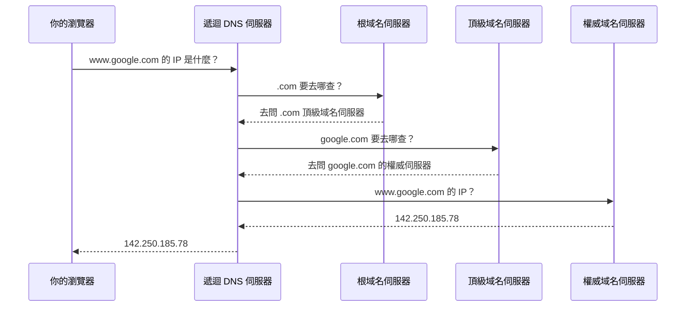

在瀏覽器輸入 `www.google.com` 並按下 Enter 後，電腦需要先查出對應的 IP 位址，才知道去哪裡連線。這項查詢由 DNS 處理。

## 先來想像一個生活情境

假設你要去找一個朋友，他跟你說：「我家在快樂街 123 號。」

你打開 Google Maps 查地址，就能知道往哪裡走。不過只有街名和門牌還不夠，不同城市可能有同名的街道，要把地區也寫清楚。網路位址也需要放在對應的網路範圍裡理解。

在網路的世界裡：

- **快樂街 123 號** = **IP 位址**（例如 `142.250.185.78`）
- **「我朋友的家」** = **域名（Domain Name）**（例如 `www.google.com`）
- **Google Maps / 導航系統** = **DNS**

## 什麼是 IP 位址？

電腦透過網路介面使用 IP 位址收送資料。你可以先把它當成網路上的地址，它長這樣：

```
142.250.185.78
```

不過，IP 不一定和電腦一對一：一台電腦可以有多個位址，家裡多台裝置也可能透過路由器共用一個對外 IP。不同家庭還能使用相同的私有 IP，因為它們分屬不同的內部網路。

但 `142.250.185.78` 這種地址很難記。

就像你不會跟朋友說「我住在北緯 25.0330° 東經 121.5654°」，而是說「我住在台北市信義區」。

## DNS — 網路世界的電話簿

DNS 的全名是 **Domain Name System**（域名系統）。它做的事情很簡單：

> **把你記得住的名字（域名），翻譯成電腦看得懂的地址（IP）。**

就像一本超級電話簿：

<div class="table-wrapper" tabindex="0" role="group" aria-label="表格（可水平捲動）">

| 你輸入的（域名）   | DNS 翻譯出的（IP 位址） |
| ------------------ | ----------------------- |
| `www.google.com`   | `142.250.185.78`        |
| `www.facebook.com` | `157.240.214.35`        |
| `www.youtube.com`  | `142.250.190.46`        |

</div>

表中的 IP 是說明用的例子，不是這些網站永遠固定的地址。輸入網址後，DNS 會查出當下的結果，電腦再用這個地址連線。

## DNS 查詢是怎麼進行的？

假設你要去一家叫「美味餐廳」的店，可以用找地址的過程來理解 DNS 查詢：

### 第一步：先問自己（瀏覽器快取）

「我之前去過嗎？記得地址嗎？」

如果你最近才去過，你的大腦（瀏覽器）還記得地址，就不用再查了。這就是**快取（Cache）**。

### 第二步：問家人（作業系統快取）

「媽，你知道美味餐廳在哪嗎？」

你的電腦作業系統也會記住最近查過的 DNS 結果。

### 第三步：打電話問 104（遞迴 DNS 伺服器）

如果家裡沒人知道，你就打電話問 104 查號台。遞迴 DNS 伺服器就像這個查號台，可能由 ISP（網路服務提供商）提供，也可能是你或瀏覽器設定的公共 DNS。

### 第四步：查號台一路往上問（根域名伺服器 → 頂級域名伺服器 → 權威域名伺服器）

查號台如果也不知道，就會去問更上級的單位：

1. **根域名伺服器**：「`.com` 的資料要去哪裡查？」
2. **頂級域名伺服器**：「`google.com` 的資料要去哪裡查？」
3. **權威域名伺服器**：「`www.google.com` 的 IP 是 `142.250.185.78`！」

最後，答案傳回電腦。有快取時不必完整跑一遍；實際耗時則會受網路延遲和 DNS 伺服器狀況影響。

用圖來看整個流程：


```mermaid
sequenceDiagram
    participant Browser as 你的瀏覽器
    participant Resolver as 遞迴 DNS 伺服器
    participant Root as 根域名伺服器
    participant TLD as 頂級域名伺服器
    participant Auth as 權威域名伺服器

    Browser->>Resolver: www.google.com 的 IP 是什麼？
    Resolver->>Root: .com 要去哪查？
    Root-->>Resolver: 去問 .com 頂級域名伺服器
    Resolver->>TLD: google.com 要去哪查？
    TLD-->>Resolver: 去問 google.com 的權威伺服器
    Resolver->>Auth: www.google.com 的 IP？
    Auth-->>Resolver: 142.250.185.78
    Resolver-->>Browser: 142.250.185.78
```

## 常見的 DNS 記錄類型

DNS 不只能翻譯 IP 位址，它其實像一本功能很多的通訊錄：

<div class="table-wrapper" tabindex="0" role="group" aria-label="表格（可水平捲動）">

| 記錄類型  | 功能              | 生活化比喻                           |
| --------- | ----------------- | ------------------------------------ |
| **A**     | 域名 → IPv4 位址  | 門牌號碼（最常用）                   |
| **AAAA**  | 域名 → IPv6 位址  | 新式門牌號碼（地址不夠用了，升級版） |
| **CNAME** | 域名 → 另一個域名 | 「這家搬到對面去了，去那邊找」       |
| **MX**    | 郵件伺服器位址    | 信箱地址（專門收信的）               |
| **TXT**   | 文字資訊          | 門口的公告欄                         |

</div>

舉個例子：當你設定自訂域名給你的部落格時（像是我把自己的網站指向 Cloudflare），你需要設定 **A 記錄** 或 **CNAME 記錄**，告訴 DNS：「如果有人要找 `worksbyaaron.com`，請帶他去這個 IP 位址。」

## 為什麼有時候網站打不開？

現在你知道 DNS 是什麼了，就能理解一些常見的狀況：

### 「DNS 解析失敗」

這就像你查電話簿找不到這個人的號碼。可能的原因：

- 域名打錯了（地址寫錯）
- DNS 伺服器暫時故障（查號台下班了）
- 域名過期沒續約（這家店已經關了）

### 「剛換完域名指向，但還是連到舊的」

DNS 有快取機制，你的電腦會記住之前查到的結果。通常需要等幾分鐘到幾小時，快取才會更新。這就像你搬了新家，但 Google Maps 上的地址可能還是舊的，需要等它更新。

TTL（Time To Live）是 DNS 記錄允許被快取的時間，可以想成資訊的保質期。它不是「修改後固定要等多久」；已經存下的舊結果，通常要等原本的 TTL 到期才會重新查詢。

### 「公司的內部網站在外面連不上」

有些域名只在公司內部的 DNS 有設定。就像公司內部的分機號碼，外面的人打不進來。

## 你可以自己試試看

### 查詢域名的 IP 位址

在你的電腦打開終端機（Terminal），輸入：

```bash
nslookup google.com
```

你會看到 `google.com` 對應的 IP 位址。這就是你的電腦在替你查 DNS 電話簿！

### 換一個 DNS 伺服器

電腦可能透過路由器使用 ISP（像是中華電信）提供的 DNS，也可能有另外設定。常見的公共 DNS 有：

<div class="table-wrapper" tabindex="0" role="group" aria-label="表格（可水平捲動）">

| DNS 服務       | 位址      | 特色         |
| -------------- | --------- | ------------ |
| Google DNS     | `8.8.8.8` | 速度快、穩定 |
| Cloudflare DNS | `1.1.1.1` | 主打隱私保護 |

</div>

換 DNS 就像換一本電話簿，查詢速度和安全性也可能跟著改變。

## 結語

回顧一下今天學到的：

- **IP 位址** = 電腦在網路上的門牌號碼
- **域名** = 我們方便記憶的名字
- **DNS** = 把域名翻譯成 IP 的電話簿
- DNS 查詢有**多層快取**機制，速度非常快
- 常見的記錄類型有 A、CNAME、MX 等

下次遇到網址打不開，可以先查 DNS 是否有回傳 IP，再確認快取和所使用的 DNS 伺服器。

---

- [Cloudflare — 什麼是 DNS？](https://www.cloudflare.com/zh-tw/learning/dns/what-is-dns/)
- [Google Public DNS](https://developers.google.com/speed/public-dns)

---

站內相關文章：

- [網路是怎麼運作的？](/posts/how-the-internet-works/)
- [瀏覽器是怎麼顯示網頁的？](/posts/how-browser-renders-webpage/)
- [DNS 深度解析 — 網路世界的地址簿與導航系統](/posts/dns-deep-dive/)
