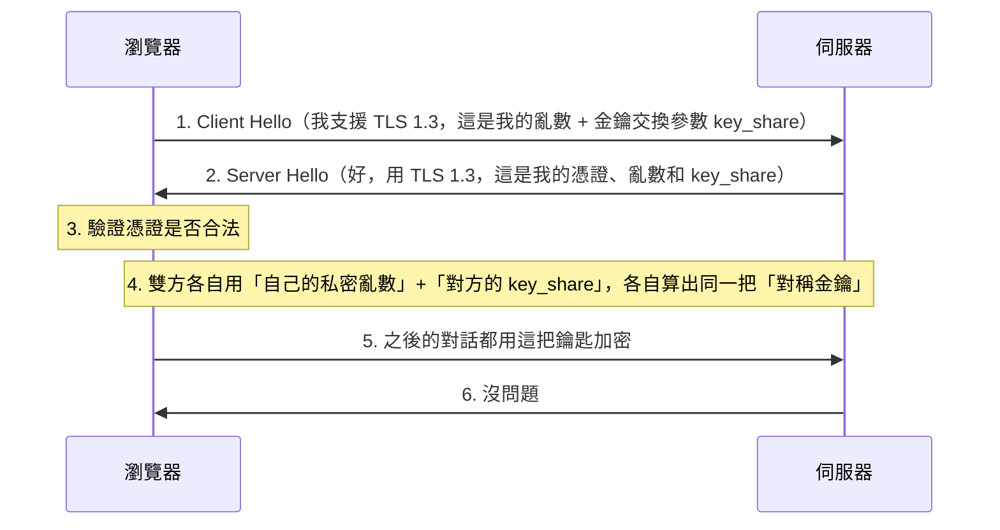

瀏覽器的連線資訊可以告訴你，網站是否使用 HTTPS（HyperText Transfer Protocol Secure）。以前常用小鎖頭表示，Chrome 後來改成了網站控制圖示，所以不能只靠「有沒有鎖頭」判斷。

HTTPS 的加密是怎麼運作的？這個 S 背後，其實有一套建立安全連線的流程。

## HTTP 的問題：明信片傳情

普通的 HTTP 就像寄明信片。你在明信片上寫了「我的密碼是 123456」，郵差看得到，轉運站的人看得到，甚至鄰居也可能瞄到。在網路世界，這意味著你的帳號密碼在傳輸過程中是**明文**的，任何中間人（ISP、公共 Wi-Fi 駭客）都能輕易竊聽。

## HTTPS 的解法：信封加鎖

HTTPS 則是先把信裝進信封，再鎖進一個保險箱寄出去。只有收件人有鑰匙能打開保險箱。這個「保險箱」機制就是 **TLS（Transport Layer Security）**，它的前身就是有名的 **SSL**。

## 核心概念：兩種加密方式

要理解 TLS，得先懂兩種加密：

### 1. 對稱加密（Symmetric Encryption）

- **原理**：用**同一把鑰匙**鎖上和打開。
- **優點**：速度快，效率高。
- **缺點**：怎麼把鑰匙安全地交給對方？如果鑰匙在傳送過程中被攔截，加密就沒用了。

### 2. 非對稱加密（Asymmetric Encryption）

- **原理**：有兩把鑰匙，**公鑰（Public Key）** 和 **私鑰（Private Key）**。
  - 在支援公鑰加密的演算法中，用公鑰加密的內容由對應的私鑰解密。
  - 數位簽章則是用私鑰簽署、公鑰驗證；這和「用私鑰加密」是不同的用途。
- **優點**：公鑰可以公開，私鑰留在持有者手上，但還是要確認收到的公鑰屬於誰。
- **缺點**：運算複雜，速度慢。

## TLS 握手（Handshake） — 建立信任的過程

TLS 握手會確認對方身分、協商加密方式，並建立傳輸用的金鑰。以下用常見的 TLS 1.3 憑證驗證搭配臨時金鑰交換來說明。圖中把伺服器的幾個訊息合併呈現，實際上憑證是在 Server Hello 之後另外送出。

```mermaid
sequenceDiagram
    participant Client as 瀏覽器
    participant Server as 伺服器

    Client->>Server: 1. Client Hello（我支援 TLS 1.3，這是我的亂數 + 金鑰交換參數 key_share）
    Server->>Client: 2. Server Hello（好，用 TLS 1.3，這是我的憑證、亂數和 key_share）
    Note over Client: 3. 驗證憑證是否合法
    Note over Client, Server: 4. 雙方各自用「自己的私密亂數」+「對方的 key_share」，各自算出同一把「對稱金鑰」
    Client->>Server: 5. 之後的對話都用這把鑰匙加密
    Server->>Client: 6. 沒問題
```

1. **打招呼**：瀏覽器跟伺服器說 Hello，同時各自附上一組用來交換金鑰的隨機參數（key_share），確認要用哪種加密演算法。
2. **給憑證**：伺服器把自己的身分證（SSL 憑證）和自己的 key_share 一起交給瀏覽器，憑證裡包含**公鑰**。
3. **驗證**：瀏覽器檢查憑證鏈是否可信、有沒有過期，以及網域名稱是否符合，並驗證伺服器持有對應的私鑰。
4. **建立共同祕密**：雙方把自己的臨時私鑰，和對方傳來的公開金鑰交換參數（key_share）一起計算，得到相同的共同祕密。私鑰和共同祕密都不直接傳送。
5. **生成會話金鑰**：雙方由共同祕密等資訊推導出傳輸用的對稱金鑰（Session Key）。實際上，兩個傳輸方向使用不同的金鑰，不是所有訊息都共用一把。
6. **開始加密通訊**：接下來雙方用各方向的對稱金鑰保護資料傳輸，兼顧效能與保密性。

這套做法叫做 (EC)DHE（Diffie-Hellman Ephemeral）金鑰交換。TLS 1.3 也支援預先共用金鑰（PSK），以及 PSK 搭配 (EC)DHE，並非只有一種模式。舊版 TLS 曾支援 RSA 金鑰交換：用伺服器公鑰加密祕密後傳送。這種方式沒有前向保密，伺服器私鑰外洩後，過去錄下的流量也可能被解密，因此 TLS 1.3 移除了它。一般完整握手只需 1 個 RTT（一來一回），實際耗時仍取決於網路延遲。

## SSL 憑證（Certificate）

憑證把網域名稱和公鑰綁在一起。連到 `google.com` 時，瀏覽器會檢查憑證是否適用於這個網域，以及簽發鏈是否可信。

如果憑證過期或網域名稱不符，瀏覽器通常會顯示警告。但釣魚網站也能替自己的網域申請有效憑證；HTTPS 保護連線，不保證網站內容或經營者可信。

現在有了 **Let's Encrypt** 這樣的免費 CA，取得憑證變得非常容易且自動化，這也是為什麼 HTTPS 能普及到幾乎所有網站的原因。

握手的完整訊息順序和金鑰交換模式，可以對照 [TLS 1.3 規範 RFC 8446](https://www.rfc-editor.org/rfc/rfc8446.html)。上面的圖適合先理解分工，實作時仍要查完整規範。

## 結語

下次查看網站的連線資訊時，可以想起這段握手流程：瀏覽器先確認憑證、建立金鑰，再用它保護傳輸中的資料。要判斷網站是否值得信任，還得另外確認網址和內容。

---

站內相關文章：

- [DNS 深度解析](/posts/dns-deep-dive/)
- [HTTP 方法與狀態碼](/posts/http-methods-status-codes/)
