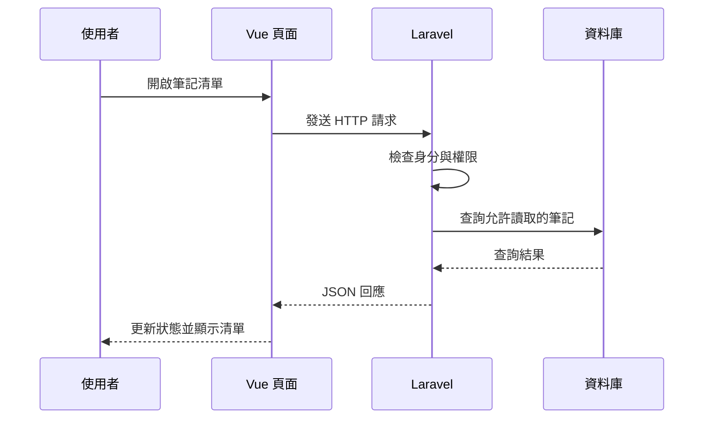

---
title: 用 Vue 的觀念理解 Laravel：前端工程師的後端入門筆記
description: 從熟悉的 Vue Router、元件、props、Pinia 與表單出發，對照 Laravel 的路由、Blade、Controller 與 Eloquent，建立理解 PHP 後端的第一張地圖。
date: 2026-09-10
category: learning
---

學一個新框架時，我比較習慣先找熟悉的東西當入口。既然已經用 Vue 寫過頁面、切過元件，也處理過路由與 API，那接觸 Laravel 時，能不能拿這些觀念來對照，讓自己更快進入狀況？

例如看到 Route，我會想到 Vue Router；看到 Blade component，我會想到 Vue 元件；看到 Model，則很容易聯想到平常放資料的 Pinia store。

這些聯想很有幫助，但有幾個地方也容易誤會。我想從熟悉的 Vue 開發方式出發，用相似的概念理解 Laravel，再釐清它們各自負責的工作。

## 先定位：Vue 與 Laravel 在同一個網站裡做什麼？

我會先把語言與框架分開看：Vue 建立在 JavaScript 上，Laravel 則使用 PHP。就像寫 Vue 還是需要理解 JavaScript 的陣列、函式與模組，寫 Laravel 也會碰到 PHP 的類別、方法與陣列。

本文以 Vue 3、Vue Router 與 Laravel 13 的文件為基準，主要從熟悉的瀏覽器端 Vue SPA 出發。Vue 也能做 SSR，但先把焦點放在「瀏覽器處理互動、伺服器處理請求」，比較容易看清楚兩邊的分工。

假設要顯示一份筆記清單，Vue 這端會關心：載入時顯示什麼？資料放在哪個狀態？點擊後如何更新畫面？Laravel 這端則會關心：誰發出請求？能讀取哪些筆記？怎麼查資料庫？最後要回傳哪些內容？



Laravel 也可以直接產生 HTML，不一定只提供 API。這張圖選的是 Vue 與 Laravel 透過 HTTP 合作的情境；Laravel 接收請求到產生回應的流程，可參考[官方生命週期說明](https://laravel.com/docs/13.x/lifecycle)。

## Vue 與 Laravel 的用途對照

我先拿熟悉的 Vue 概念來理解 Laravel。像 Controller 和事件處理函式都會接住操作，但接下來要負責的事不完全相同。

<div class="table-wrapper" tabindex="0" role="group" aria-label="Vue 與 Laravel 觀念對照表（可水平捲動）">

| 熟悉的 Vue 觀念      | 理解 Laravel 的入口      | 要留意的差異                                  |
| -------------------- | ------------------------ | --------------------------------------------- |
| Vue Router           | Route                    | 一邊決定顯示的頁面元件，一邊接收 HTTP 請求    |
| 元件 template        | Blade template           | Vue 可隨狀態更新畫面；Blade 在伺服器產生 HTML |
| props、slot          | Blade 元件的資料與 slot  | 組合畫面的想法相近，執行位置與互動方式不同    |
| 頁面裡的資料載入函式 | Controller action        | Controller 在伺服器協調一次請求的處理         |
| 導航守衛             | Middleware               | 前端導頁控制之外，後端仍須獨立驗證請求        |
| 表單檢查             | Validation、Form Request | 即時提示與伺服器輸入檢查各有責任              |
| Pinia store          | 用來對照 Eloquent Model  | store 管理應用狀態；Model 負責資料庫存取      |

</div>

## 從 Vue Router 理解 Laravel Route

在 Vue Router 裡，我習慣把網址對應到頁面元件。下面是路由設定中的一個項目：

```javascript
const routes = [
  {
    path: "/notes",
    component: () => import("./pages/NotesPage.vue"),
  },
];
```

意思是走到 `/notes` 時，讓對應的元件顯示在 `RouterView`。在 SPA 內透過 RouterLink 導航，通常不需要重新載入整份 HTML。這是 [Vue Router 的基本用法](https://router.vuejs.org/guide/)。

Laravel 的路由看起來也很直覺。在 `routes/web.php` 可以寫：

```php
use App\Http\Controllers\NoteController;
use Illuminate\Support\Facades\Route;

Route::get('/notes', [NoteController::class, 'index']);
```

但這裡的意思是：**伺服器收到 `GET /notes` 時，交給 Controller 的 `index` 方法處理。** 方法最後可以回傳 HTML，也可以回傳 JSON。

這也是我理解 Laravel 時很重要的轉換：同樣叫路由，Vue Router 著重在前端顯示哪個頁面，Laravel Route 著重在伺服器怎麼處理請求。

如果採用前後端分離，可以讓前端 `/notes` 顯示頁面，再向後端 `/api/notes` 取資料。Laravel 的 API 路由需先啟用，預設會加上 `/api` 前綴；不能只看到教學寫 `api.php`，就假設每個新專案都已經有這個檔案。參考 [Laravel 路由文件](https://laravel.com/docs/13.x/routing)。

## 從 template、props 與 slot 理解 Blade

Vue 裡的元件可以接收資料，再把資料放進 template。像一個簡單的筆記卡片：

```vue
<script setup>
defineProps({ title: String });
</script>

<template>
  <article>
    <h2>{{ title }}</h2>
    <slot />
  </article>
</template>
```

父元件傳入 `title`，卡片中間的內容交給 slot。這種「把重複畫面抽出來，差異透過資料與內容傳入」的思考方式，可以帶到 Blade。Vue 的相關觀念見[元件基礎文件](https://vuejs.org/guide/essentials/component-basics.html)。

Laravel 的 Blade 是伺服器端模板引擎。假設在 `resources/views/components` 目錄建立 `note-card.blade.php`，可以寫成：

```blade
@props(['title'])

<article>
    <h2>{{ $title }}</h2>
    {{ $slot }}
</article>
```

然後在其他 Blade 模板使用它：

```blade
<x-note-card title="Laravel 學習筆記">
    先從熟悉的元件概念開始。
</x-note-card>
```

看到這裡就比較有親切感了：元件、輸入資料、插入內容，都是我在 Vue 裡用過的組合方式。

不過，**Blade 的 `{{ $title }}` 是產生 HTML 時輸出資料，不會因此建立 Vue 那樣的響應式綁定。** 頁面到了瀏覽器，若要點按鈕即時修改內容，還需要 JavaScript 或其他互動方案。Blade 本身不會因為伺服器某個 PHP 變數改變，就自動更新已開啟的頁面。參考 [Blade 文件](https://laravel.com/docs/13.x/blade)。

## Controller：把「收到請求後要做什麼」集中起來

在 Vue 頁面裡，我可能會有一個 `loadNotes()`：呼叫 API、拿到資料、更新 `notes` 狀態。Laravel 的 Controller 可以接著回答另一半問題：API 收到請求後，到底要做什麼？

以下是放在 `NoteController` 類別中的示意方法。假設已建立 `Note` 模型、筆記資料表與 session 登入，並在路由加上 `auth` middleware：

```php
public function index(\Illuminate\Http\Request $request)
{
    $notes = \App\Models\Note::query()
        ->where('user_id', $request->user()->id)
        ->latest()
        ->get(['id', 'title']);

    return response()->json(['data' => $notes]);
}
```

先不用把每個符號都背下來，順著讀就好：找到目前登入者的筆記、依建立時間由新到舊排序、取出需要的欄位，然後回傳 JSON。範例用完整類別名稱方便辨識來源，實際專案通常會在檔案上方用 `use` 匯入。

我會把 Controller 理解成「這個請求的處理入口」。它會協調驗證、資料存取與回應；功能變複雜時，再把適合共用的邏輯抽出去。它跟 Vue 元件負責的畫面互動不同，也不需要一開始就塞進所有商業邏輯。參考 [Controller 文件](https://laravel.com/docs/13.x/controllers)。

## 從導航守衛理解 Middleware，但權限要在後端確認

Vue Router 的導航守衛可以在切換頁面前檢查狀態，例如沒登入就導向登入頁。Laravel 的 Middleware 也有「先通過這一關，才繼續往下走」的感覺。

剛才的筆記路由加上登入要求，會變成：

```php
Route::get('/notes', [NoteController::class, 'index'])
    ->middleware('auth');
```

差別在於，前端守衛主要控制瀏覽器裡的導航；使用者仍可能繞過介面，直接向後端送請求。因此即使 Vue 已經擋住未登入者，Laravel 仍要確認身分。

而且登入不等於擁有所有資料的權限。上面的查詢用登入者 ID 限制筆記範圍；若加入修改或刪除，就還需要確認那一筆筆記是否允許此人操作。這類資源權限可以交給 Policy 管理。可對照 [Vue Router 導航守衛](https://router.vuejs.org/guide/advanced/navigation-guards.html) 與 [Laravel 授權文件](https://laravel.com/docs/13.x/authorization)。

## 從 v-model 與表單檢查理解後端 Validation

Vue 的 `v-model` 讓輸入欄位與 JavaScript 狀態保持同步，但它本身不會替我驗證商業規則。在 Vue 裡，我可能會另外檢查標題是不是空白，讓使用者在送出前就看到提示。綁定行為見 [Vue 表單文件](https://vuejs.org/guide/essentials/forms.html)。

到了 Laravel，則需要對收到的輸入再做檢查。下面是 Controller 方法裡的一段驗證：

```php
$validated = $request->validate([
    'title' => ['required', 'string', 'max:120'],
    'body' => ['required', 'string', 'max:10000'],
]);
```

我會把這兩層想成不同責任：前端幫使用者盡快修正輸入，後端決定資料是否可以被接受。前端的規則、按鈕禁用狀態或 TypeScript 型別，都不能替代後端檢查。

當請求預期 JSON 回應時，Laravel 驗證失敗會回傳 422 與欄位錯誤。Vue 收到後，再把 `errors.title` 這類訊息放回欄位旁邊。傳統表單請求則通常是重新導向並保存錯誤訊息，不能把所有驗證失敗都當成 JSON。

等規則變多，再用 Form Request 把驗證與授權整理成獨立類別。這時候有點像我把 Vue 頁面裡太長的邏輯抽出去：目的是讓責任更清楚，但兩者的執行環境與功能並不相同。參考 [Laravel 驗證文件](https://laravel.com/docs/13.x/validation)。

## 最容易誤會的地方：Eloquent Model 與 Pinia

看到 Model 負責資料，很容易想成「Laravel 版的 store」。這個聯想可以幫忙記名字，但實際寫功能時，我會刻意把兩者分開。

Pinia store 管理的是前端應用的共享狀態，例如目前顯示的筆記、篩選條件或登入者資訊。沒有另外做持久化時，完整重新整理頁面後，記憶體裡的狀態需要重新建立。Vue 對共享狀態的說明可見[狀態管理文件](https://vuejs.org/guide/scaling-up/state-management.html)。

Eloquent Model 則是 PHP 裡操作資料庫記錄的工具。像 `Note::query()` 會建立查詢，`get()` 才取得結果；修改模型屬性後，通常還要呼叫 `save()` 才會把變更寫入資料庫。相關行為見 [Eloquent 文件](https://laravel.com/docs/13.x/eloquent)。

所以在 Vue 執行 `notes.value.push(newNote)`，只是更新前端陣列。若希望筆記重新整理後還在，就要經過請求、後端驗證與資料庫寫入，再用回傳結果更新畫面。

這也是學後端時要多想的一步：**畫面上已經有資料，跟資料已經成功保存，是兩件需要分別確認的事。**

## PHP 語法先學到能讀懂流程

理解了檔案各自的責任後，再補 PHP 語法，會比一開始就背整本語言手冊容易。我會先辨認幾個閱讀 Laravel 時常見的寫法：

```php
$title = '今天的筆記';
$data = ['title' => $title];

$note->title = $data['title'];
$note->save();

$notes = Note::query()->latest()->get();
```

`$` 開頭是變數；`['title' => $title]` 是用字串作為鍵的 PHP 陣列；`->` 存取物件屬性或呼叫方法。`Note::query()` 則是透過類別呼叫 Eloquent 提供的查詢入口。先能順著程式讀出「取資料、處理資料、回傳結果」，後續再深入型別、命名空間與依賴注入。

PHP 陣列同時能表達有順序的項目與鍵值對，不能把它完全當成 JavaScript 的 Array。語法細節可參考 [PHP 陣列](https://www.php.net/manual/en/language.types.array.php)與[物件基礎](https://www.php.net/manual/en/language.oop5.basic.php)。

## 我會怎麼安排下一步練習？

如果目標是用既有的 Vue 經驗快速上手，我會先保留熟悉的 Vue 頁面，只把原本假資料的來源換成 Laravel，再逐步增加功能：

1. 做一個回傳固定 JSON 的路由，先打通 Vue 到 Laravel 的請求。
2. 把處理搬到 Controller，認識路由與方法的對應。
3. 接上 Model 與資料庫，讓清單有真正的資料來源。
4. 加入表單驗證，讓 Vue 能顯示後端回傳的欄位錯誤。
5. 補上登入與資料權限，再檢查未登入、輸入錯誤與越權操作的情況。

這樣每次只增加一個需要理解的部分，也能繼續使用熟悉的 Vue 除錯方式，觀察 Network 裡的請求與回應。

對我來說，Vue 經驗最有幫助的地方，是已經習慣拆分責任、追蹤資料流，以及思考失敗時畫面要怎麼反應。把視線沿著 HTTP 請求往伺服器多追一段，Laravel 的 Route、Controller、Validation 與 Model 就比較容易找到各自的位置。
