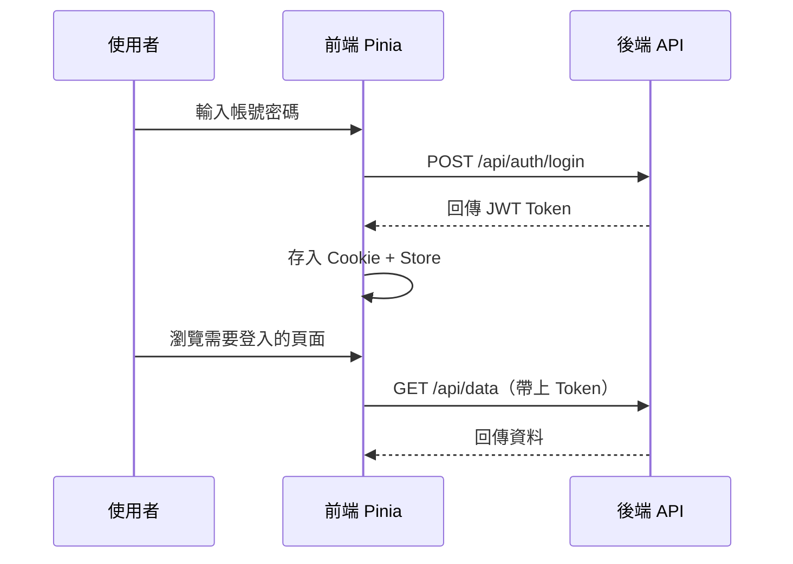

最近幾個專案都有會員系統的需求，也用了好幾次 JWT 驗證。以下整理我在 Nuxt 3 中的實作方式，以及處理登入狀態時要注意的細節。

範例以 Nuxt 3、已啟用 `@pinia/nuxt` 的專案為前提，fetch hook 使用 ofetch 1.4 以上的 `Headers` 行為。`User` 與 `LoginCredentials` 是專案自己的型別，登入 API 的回傳格式假設為 `{ token, userData }`，實作時要依後端規格調整。Cookie 設了 `secure: true`，本機驗證也應使用 HTTPS 或確認開發環境的 cookie 設定。

## JWT 是什麼

JWT（JSON Web Token）是一種攜帶資料的格式，常用在登入驗證流程中。這裡討論的是帶有簽章的 JWT，後端仍要驗證簽章、有效期限等條件，不能只讀取裡面的資料就信任它。流程大概是這樣：

1. 使用者輸入帳號密碼登入
2. 後端驗證成功後，產生一組 JWT 回傳給前端
3. 前端把這個 token 存起來
4. 之後每次打 API 都帶上這個 token
5. 後端收到請求時，驗證 token 是否有效

後端可以驗證 JWT 而不逐次讀取 session，這對水平擴展有幫助。不過，如果需要立即撤銷登入、確認最新權限，仍可能查詢資料庫或保存伺服器端狀態，要看系統怎麼設計。


```mermaid
sequenceDiagram
    participant User as 使用者
    participant Frontend as 前端 Pinia
    participant API as 後端 API

    User->>Frontend: 輸入帳號密碼
    Frontend->>API: POST /api/auth/login
    API-->>Frontend: 回傳 JWT Token
    Frontend->>Frontend: 存入 Cookie + Store
    User->>Frontend: 瀏覽需要登入的頁面
    Frontend->>API: GET /api/data（帶上 Token）
    API-->>Frontend: 回傳資料
```

## 前端需要處理什麼

前端在 JWT 驗證流程中要處理的事情：

1. 登入時把 token 存起來
2. 每次打 API 時自動帶上 token
3. 處理 token 過期的情況
4. 登出時清除 token
5. 重新整理頁面時恢復登入狀態

## Cookie + Pinia 雙層管理

這份範例採用 Cookie 存 token、Pinia 管理畫面狀態的做法。

Cookie 可以讓重新整理後的請求帶上 token，是否在關閉瀏覽器後保留，要看有效期限設定。Pinia 則讓元件方便地共用登入狀態，但畫面上顯示已登入，不代表伺服器已確認 token 有效。

```typescript
// stores/auth.ts
import { defineStore } from "pinia";

export const useAuthStore = defineStore("auth", () => {
  const tokenCookie = useCookie<string | null>("auth_token", {
    // 範例為求簡化，用 7 天的長效單一 token；
    // 正式環境建議改用短效 access token（幾小時內）+ refresh token，並實作換發機制
    maxAge: 60 * 60 * 24 * 7, // 7 天
    secure: true,
    sameSite: "strict",
  });

  const user = ref<User | null>(null);
  const isLoggedIn = computed(() => !!tokenCookie.value);

  const login = async (credentials: LoginCredentials) => {
    const { token, userData } = await $fetch<{ token: string; userData: User }>(
      "/api/auth/login",
      {
        method: "POST",
        body: credentials,
      },
    );
    tokenCookie.value = token;
    user.value = userData;
  };

  const logout = () => {
    tokenCookie.value = null;
    user.value = null;
  };

  return { token: tokenCookie, user, isLoggedIn, login, logout };
});
```

用 `useCookie` 的好處是它在 SSR 和 CSR 都能用。Server 端 render 時會從 request header 讀 cookie，client 端就讀 document.cookie，不用自己處理這些差異。

## 自動帶上 Token

每次呼叫自己的 API 都要手動帶 token 太麻煩了，可以用 plugin 建立 fetcher。這裡只接受以 `/api/` 開頭的站內路徑，避免把 token 帶到其他主機：

```typescript
// plugins/api.ts
import { useAuthStore } from "~/stores/auth";

export default defineNuxtPlugin((nuxtApp) => {
  const authStore = useAuthStore();

  const api = $fetch.create({
    retry: 0,
    onRequest({ request, options }) {
      if (
        typeof request !== "string" ||
        !request.startsWith("/api/") ||
        (options.baseURL && options.baseURL !== "/")
      ) {
        throw new Error("$api 只接受站內 /api/ 路徑");
      }

      if (authStore.token) {
        // ofetch 已把 options.headers 正規化成 Headers 實例，
        // 用物件展開會得到空物件並毀掉原有的標頭，必須改用 .set()。
        options.headers.set("Authorization", `Bearer ${authStore.token}`);
      }
    },
    async onResponseError({ response }) {
      if (response.status === 401) {
        authStore.logout();
        await nuxtApp.runWithContext(() => navigateTo("/login"));
      }
    },
  });

  return { provide: { api } };
});
```

元件中先用 `const { $api } = useNuxtApp()` 取得 fetcher，再呼叫 `$api("/api/data")`。收到 401 時會清除登入狀態，並等待導向登入頁；非同步 hook 的導頁透過 `runWithContext` 執行，保留 Nuxt context。這個寫法也可對照[官方 custom useFetch 範例](https://nuxt.com/docs/3.x/guide/recipes/custom-usefetch)。

`retry: 0` 讓這份登入範例不自動重試，hook 也拒絕另外指定的 `baseURL`（站內根路徑 `/` 除外）。第三方服務請用另一個 fetcher，不要覆寫這個 request hook，或把 `/api/` 做成任意網址的轉送端點。若要改成接受完整網址的工具，應先驗證實際目的地，再附加憑證。

## 頁面權限控制

有些頁面只有登入後才能看，用 Nuxt 的 middleware 來控制：

```typescript
// middleware/auth.ts
import { useAuthStore } from "~/stores/auth";

export default defineNuxtRouteMiddleware(() => {
  const authStore = useAuthStore();

  if (!authStore.isLoggedIn) {
    return navigateTo("/login");
  }
});
```

在需要保護的頁面，把下面這段放進 `<script setup>`，指定 middleware：

```typescript
// pages/dashboard.vue
definePageMeta({
  middleware: "auth",
});
```

頁面 middleware 只能處理導頁和使用體驗。API 仍要在伺服器端驗證登入與資料權限，不能因為前端藏了頁面，就省略後端檢查。

## 初始化登入狀態

頁面載入時要恢復登入狀態，可以在 plugin 處理：

```typescript
// plugins/auth.ts
import { useAuthStore } from "~/stores/auth";

export default defineNuxtPlugin(async () => {
  const authStore = useAuthStore();

  // 如果有 token，嘗試取得使用者資訊
  if (authStore.token) {
    try {
      const userData = await $fetch<User>("/api/auth/me", {
        headers: { Authorization: `Bearer ${authStore.token}` },
      });
      authStore.user = userData;
    } catch {
      // 簡化範例：任何錯誤都清除登入狀態，正式環境要區分原因
      authStore.logout();
    }
  }
});
```

初始化範例為了簡化，把取得使用者資料時的所有錯誤都當成登出。正式使用時，要區分認證失效、網路中斷和伺服器暫時故障，避免只是 API 暫時連不上，就清掉仍有效的登入狀態。

## 實務經驗

做過幾個專案後，有一些經驗：

1. **Token 不要存敏感資訊**：JWT 的 payload 只是 base64 編碼，不是加密，任何人都能解開來看

2. **useCookie 存 token 一樣有 XSS 風險**：範例裡的 `auth_token` cookie 沒有設定 `httpOnly`，因為前端還要用 `authStore.token` 組出 `Authorization` header，架構上本來就無法設成 httpOnly。也就是說網站一旦被注入惡意 script，這顆 cookie 照樣能被讀走，風險其實跟存在 localStorage 差不多，只是多了「SSR 或重新整理頁面時不用等 client 端恢復」的方便。如果前後端在同一個網域，更安全的做法是讓後端直接發 httpOnly Cookie，前端不主動讀 token，改由 Server 端轉發 API 請求

3. **設定合理的過期時間**：依資料敏感程度和登入需求決定，不要把某個時長當成通用標準。需要延長登入時，可以搭配 refresh token 與撤銷機制；本文的單一長效 token 是簡化範例，不宜直接套用到正式系統

4. **登出要確實清除**：cookie 要清，store 也要清

5. **錯誤處理要完整**：網路斷線、token 過期、權限不足，這些情況都要跟使用者說清楚

Cookie 的傳送方式、有效期限和安全屬性，可以對照 [OWASP 的 Session Management 指引](https://cheatsheetseries.owasp.org/cheatsheets/Session_Management_Cheat_Sheet.html)。選擇 HttpOnly Cookie 時，仍需要防範 XSS 觸發操作，以及依架構處理 CSRF，不能只靠一個屬性。

## 結語

Cookie + Pinia 是 Nuxt 3 專案中常見的登入狀態管理方式：Cookie 保存 token，Pinia 讓全站存取狀態，也能配合 SSR 恢復登入資訊。實作時仍要留意前面提到的 XSS 風險、token 過期與登出清除，不能只確認畫面顯示已登入。

---

站內相關文章：

- [藝術銀行 Art Bank 開發紀錄](/posts/artbank-nuxt3-ssr-development/)
- [API 請求卡住怎麼辦？Timeout、Retry 與 Circuit Breaker](/posts/api-resilience-patterns/)
